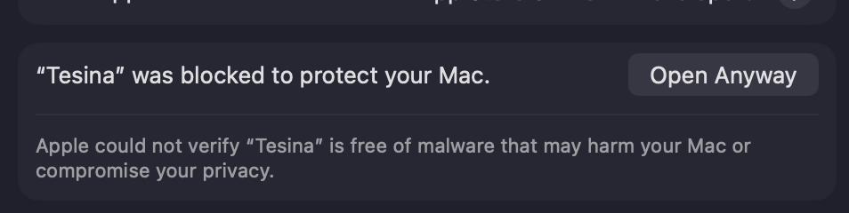

# Tesina

[Download Tesina for macOS](https://github.com/adominicci/apa/releases/latest/download/Tesina-macos-universal.dmg)

Tesina is a free, local academic writing app that helps students format papers
in APA 7 style. It runs without an account, and your papers remain on your
computer. The interface and each document can use English or Spanish
independently.

Version 0.1.1 supports student papers on macOS 11 or newer. It is distributed
as a DMG through GitHub Releases, not through the Mac App Store. Windows and
Linux builds are checked in CI but are not published or supported yet.

## Install on macOS

1. Download and open the DMG.
2. Drag Tesina to the Applications folder.
3. Open Tesina from Applications. macOS will block this first launch because
   version 0.1.1 is not signed or notarized with an Apple Developer certificate.
4. In the **Tesina Not Opened** message, choose **Done**. Tesina will close. This
   is expected. Do not choose **Move to Trash** unless you want to delete the
   app.
5. Open **System Settings**, select **Privacy & Security**, and scroll down to
   **Security**.
6. Find the message that says Tesina was blocked and choose **Open Anyway**.

   

7. Enter your Mac login password if asked, then confirm **Open**. macOS saves
   Tesina as an exception, so later launches open normally.

The **Open Anyway** option is available for about one hour after the blocked
launch. If you already moved Tesina to Trash, restore it or copy it again from
the DMG before repeating these steps. Apple documents this process in
[Open a Mac app from an unknown developer](https://support.apple.com/guide/mac-help/open-a-mac-app-from-an-unknown-developer-mh40616/26/mac/26).

## What it does

- Builds APA 7 student title pages and checks required title-page details
  before Word export.
- Keeps the editor, paged preview, and Word export aligned for headings,
  appendices, lists, tables, figures, equations, citations, and references.
- Formats in-text citations and reference entries in English or Spanish.
- Manages a reusable reference library with collections, DOI, ISBN, and URL
  autofill, plus BibTeX import with a review step.
- Provides a paged preview and exports `.docx` files for Microsoft Word and
  compatible editors.
- Saves locally with atomic autosave and creates a timestamped backup before a
  paper is deleted. Tesina has no account system or cloud service.

Tesina follows the public [APA Style paper-format guidance](https://apastyle.apa.org/style-grammar-guidelines/paper-format/), but students should still follow any instructions provided by their instructor or institution.

## Updates

Tesina checks the latest published GitHub Release when the app opens. If an
update is available, the app asks before downloading or installing it. After
installation, Tesina restarts and shows the release notes once in plain text.
An app update does not replace your locally saved papers.

The updater verifies release artifacts with Tesina's updater key. This is
separate from Apple Developer signing and notarization, which are not included
in version 0.1.1.

## Run from source

Requirements:

- Deno 2
- Rust 1.88 or newer
- The [Tauri 2 prerequisites](https://v2.tauri.app/start/prerequisites/) for your operating system

Install dependencies and start the desktop app:

```bash
deno install
deno task dev
```

Run the repository checks from the project root:

```bash
deno task check
deno task test
deno fmt --check
deno lint
```

`deno task build` creates local bundles after a Tauri updater signing key is
available in `TAURI_SIGNING_PRIVATE_KEY`. Keep private keys outside the
repository. The published macOS DMG is created by the release workflow.

## License and name

Tesina is available under the [MIT License](LICENSE).

Tesina bundles the Inter interface font under the
[SIL Open Font License 1.1](apps/desktop/src-tauri/resources/Inter-OFL-1.1.txt).

Tesina is an independent project. It is not affiliated with, endorsed by, or
sponsored by the American Psychological Association. “APA” identifies the
formatting style the app is designed to help apply.
